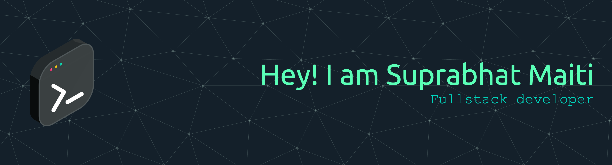

<!--  -->

<div align="center">
  
  
  ## Hi, I'm Suprabhat Maiti 
  
  ### Full-Stack Developer | Building Scalable, Secure, and Real-time Applications

---

<p align="center">
    <a href="https://www.linkedin.com/in/suprabhat-maiti/">
      
    </a>
    <a href="mailto:maitisuprabhat@gmail.com">
      
    </a>
  </p>

<div align="center">

##  About Me </div>

</div>
<div>


```javascript
const Suprabhat = {
  location: "India",
  background:
    "Full-Stack Developer with a passion for quality-driven development",
  focus:
    "Building robust applications, ensuring software reliability, and optimizing user experience",
  learning: ["System Design", "Automated Testing"],
  hobbies: ["Coding", "Debugging", "Litening Music"],
};

const skills = async () => {
  await writeCleanCode();
  await designAndExecuteTests();
  await learnNewTechAndTools();
  return growAsEngineer();
};

skills();
```

<!-- https://user-images.githubusercontent.com/74038190/212284100-561aa473-3905-4a80-b561-0d28506553ee.gif -->

</div>
<div>

### 🛠️ Tech Stack & Tools

<table align="center">
  <tr>
    <td align="center" width="200">
      <h4>💻 Programing Languages</h4>
    </td>
    <td>
      
      
      
      
    </td>
  </tr>
  <tr>
    <td align="center">
      <h4>🎨 Frontend</h4>
    </td>
    <td>
      
      
      
      
    </td>
  </tr>
  <tr>
    <td align="center">
      <h4>⚙️ Backend</h4>
    </td>
    <td>
      
      
      
    </td>
  </tr>
  <tr>
    <td align="center">
      <h4>🗄️ Database</h4>
    </td>
    <td>
        
    </td>
  </tr>
  <tr>
    <td align="center">
      <h4>📊 Data Science</h4>
    </td>
    <td>
      
      
      
      
    </td>
  </tr>
</table>

---

</div>
<div>

## 💡 Featured Projects

### 🚀 Auction Central: Real-Time Bidding Platform

   

A full-stack, transactional online auction system built to handle high-frequency, real-time bidding using WebSockets.

| **Focus**     | **Key Technical Feature**                                                                                   |
| :------------ | :---------------------------------------------------------------------------------------------------------- |
| **Real-Time** | Instant bid updates using **Socket.IO** with server-side sequence (`seq`) tracking for data consistency.    |
| **Integrity** | **PostgreSQL Transactions** (`BEGIN`/`COMMIT`) ensure atomic bidding logic.                                 |
| **Stability** | **Anti-Sniping Logic** dynamically extends the auction end time when a bid is placed close to the deadline. |
| **Backend**   | Robust API design featuring image compression and JWT-protected endpoints.                                  |

- [**Repo Link**](https://github.com/suprabhatmaiti/auction)

---

### 📋 TaskFlow: Secure Task Management Dashboard

  

A modern, secure CRUD application for task management with a focus on protected routing, robust filtering, and clean architecture.

| **Focus**        | **Key Technical Feature**                                                                              |
| :--------------- | :----------------------------------------------------------------------------------------------------- |
| **Security**     | Implements robust **JWT + Refresh Token** authentication handled via HTTP-only cookies.                |
| **Data Flow**    | Dedicated **Services** decouple UI from API calls, and **Reducers** manage complex form state.         |
| **Architecture** | Clearly segregated `src/client` and `src/server` directories ensure a scalable, maintainable codebase. |
| **Filtering**    | Comprehensive server-side filtering and pagination for task lists by date, search term, and priority.  |

- [**Repo Link**](https://github.com/suprabhatmaiti/TaskFlow)
</div>

---

## 📊 My GitHub Stats

<div align="center">
  
  
</div>

<div align="center">
  
  
</div>


---

[](https://visitcount.itsvg.in)

<p align="center">

</p>


